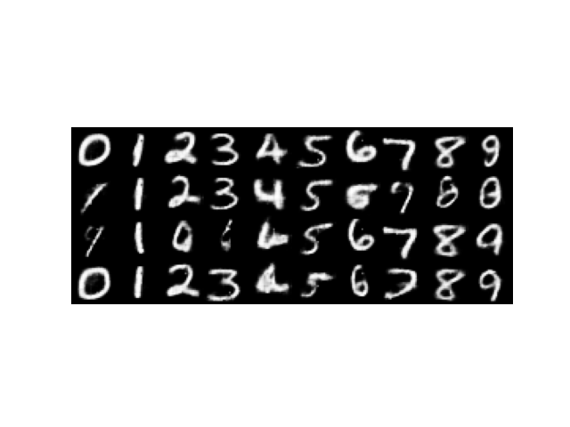

# Extended VQGAN-CLIP
## 项目介绍
目前，大部分文生图模型需要大量图文对数据、大量计算资源和长时间的训练。以Taiyi-Stable-Diffusion为例：该模型需要使用8 x A100在约1.2亿图文对上训练180个小时。然而，在大部分下游任务中，难以收集到足够的图文对数据进行训练或微调。

本项目基于[VQGAN-CLIP](https://arxiv.org/abs/2204.08583)架构,并对其进行了扩展，从而**能够使用不同模型(VQVAE,VQGAN,Diffusion)作为生成器**，并**支持不同语言(en,zh)的文本条件**。

本项目特点如下：
- 不需要图文对数据，仅使用开源的CLIP。
- 可扩展性强，能兼容不同语言的文本条件。
- 尽可能少的算力和训练时间。

## 预训练模型概览
以下是本项目用到的预训练模型：
- 开源检查点
  - [VQGAN](https://github.com/CompVis/taming-transformers)
  - [Guided-diffusion](https://github.com/openai/guided-diffusion)
  - [openai-CLIP](https://github.com/openai/CLIP)
  - [cn-clip](https://github.com/ofa-sys/chinese-clip)
- 本项目训练的检查点
  - [VQVAE-2048](https://www.kaggle.com/datasets/czy111/vqvae-2048)
  - [VQVAE-16384](https://www.kaggle.com/datasets/czy111/vqvae-16384)

两个VQVAE模型的差别是使用的codebook大小不同。

## 使用方法
在kaggle上运行相应的笔记本：
- [VQGAN/VQVAE-CLIP](https://www.kaggle.com/code/czy111/clip-guided-vqvae-and-vqgan)
- [Diffusion-CLIP](https://www.kaggle.com/code/czy111/clip-guided-openai-diffusion)

项目代码经过充分的封装，修改相应的参数即可使用。

## 效果展示

本项目选择Taiyi-Stable-Diffusion作为基线，结果表明，本项目生成的图像的**语义准确度较高**。基线模型经常出现生成的图像只关注到提示词中的实体的情况，而本项目模型则很少发生这种情况。但生成的图像的保真度稍差，这是VQGAN-CLIP架构的固有问题。

## 训练预训练模型
对于生成图像的风格（如动漫）与上述预训练模型差异较大的情况，可以在自己的数据集上训练VQVAE模型。训练笔记本如下：
- [training-VQVAE](https://www.kaggle.com/code/czy111/training-my-vqvae-ilsvrc)

更改相应的数据集即可训练自己的VQVAE模型。根据计算资源等各方面限制可以训练不同规模的codebook。

## 更多资源
本项目还提供了VQGAN-CLIP架构的最小实现，以便于理解VQGAN-CLIP的工作原理。其中使用VAE作为生成器，一个卷积网络作为类别引导器，核心原理与VQGAN-CLIP相同。
代码如下：
- [mini VQGAN-CLIP](https://www.kaggle.com/code/czy111/mini-vqgan-clip)

结果：

